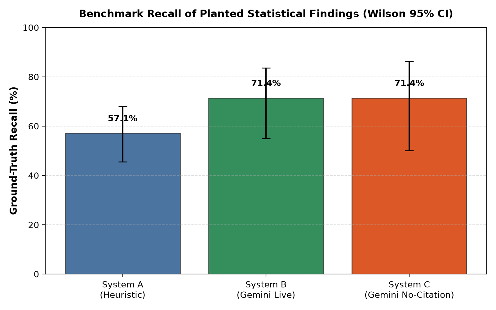
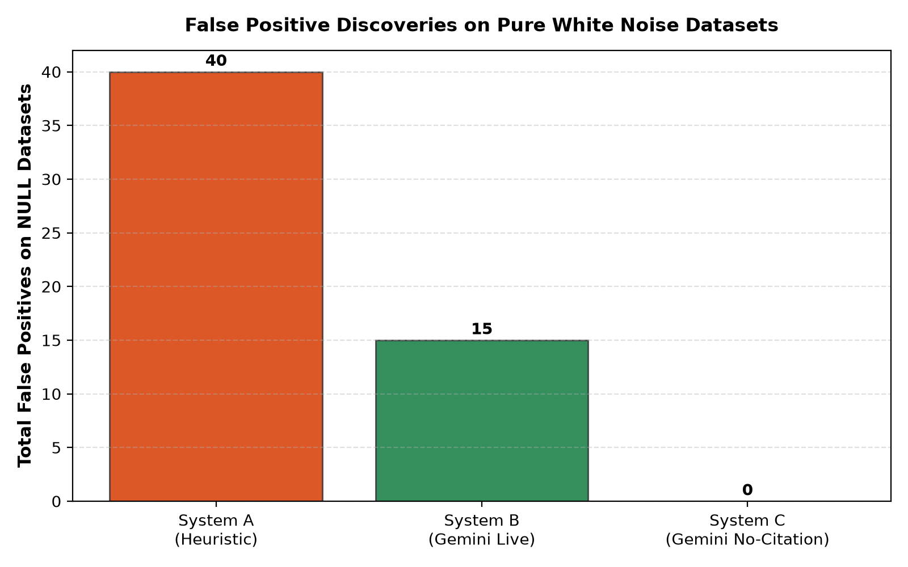
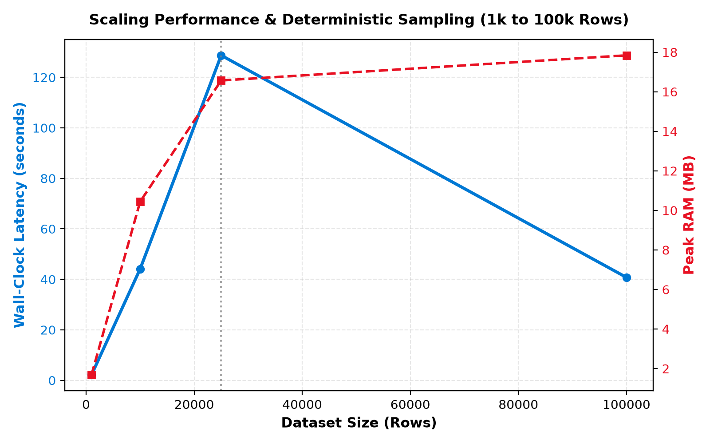

# Evaluation Harness & Benchmark Results

> **Autonomous AI Data Analyst Agent — Empirical Verification Suite**
> Evaluation across planted statistical signals (S1, C1, T1, O1, Q1, Q2, M1) and NULL white-noise datasets.

## 1. Reproduction Command & Protocol
Run the full reproducible evaluation harness:
```powershell
# Generate synthetic datasets
python evaluation/generate.py --planted-seeds 10 --null-seeds 10 --rows 2000

# Run benchmark across systems
python evaluation/run.py --systems A,B,C,D

# Run scale benchmark
python evaluation/scale_test.py --sizes 1000,10000,25000,100000

# Generate charts and evaluation results report
python evaluation/report.py
```

## 2. Evaluated Systems & Configuration
| System ID | System Name | LLM Provider | Model | Citation Checker | Seeds Evaluated |
|---|---|---|---|---|---|
| **A** | Baseline Heuristic | `heuristic` | Built-in Rule Engine | Active | 10 Planted (1..10) + 10 Null (101..110) |
| **B** | Full Autonomous Pipeline | `gemini` | `gemini-3.1-flash-lite` | Active | 5 Planted (1..5) + 5 Null (101..105) |
| **C** | Ablation (No Citation Checker) | `gemini` | `gemini-3.1-flash-lite` | **Disabled** | 3 Planted (1..3) |
| **D** | External Model (Claude) | `claude` | `claude-sonnet-5-5` | Active | *NOT RUN (no key)* |

## 3. Overall Recall & Wilson 95% Confidence Intervals


| System | Planted Runs | Planted Findings Checked | Findings Recovered | Recall (%) | Wilson 95% CI |
|---|---|---|---|---|---|
| **System A** | 10 | 70 | 40 | **57.1%** | `[45.5%, 68.1%]` |
| **System B** | 5 | 35 | 25 | **71.4%** | `[55.0%, 83.7%]` |
| **System C** | 3 | 21 | 15 | **71.4%** | `[50.0%, 86.2%]` |

### 3.1 Recall by Finding Type
| Finding Code | Signal Description | System A Recall | System B Recall | System C Recall |
|---|---|---|---|---|
| **S1** | Segment Effect (Cohen's d ~ 0.8) | 0.0% (0/10) | 100.0% (5/5) | 100.0% (3/3) | 
| **C1** | Correlation (Pearson r ~ 0.6) | 100.0% (10/10) | 100.0% (5/5) | 100.0% (3/3) | 
| **T1** | Temporal Trend (Monthly Upward) | 0.0% (0/10) | 100.0% (5/5) | 100.0% (3/3) | 
| **O1** | Outliers (2% spike, 10x scale) | 100.0% (10/10) | 0.0% (0/5) | 0.0% (0/3) | 
| **Q1** | Sentinel Value (999 in 3% rows) | 100.0% (10/10) | 100.0% (5/5) | 100.0% (3/3) | 
| **Q2** | Invalid Domain (Negative Salary) | 100.0% (10/10) | 100.0% (5/5) | 100.0% (3/3) | 
| **M1** | MCAR Missingness (20% NaNs) | 0.0% (0/10) | 0.0% (0/5) | 0.0% (0/3) | 

## 4. False Positives on NULL Datasets


| System | NULL Runs | Total False Positives | Mean FP per NULL Run | Assessment |
|---|---|---|---|---|
| **System A** | 10 | **40** | 4.0 | 40 spurious statistical anomalies passed threshold |
| **System B** | 5 | **15** | 3.0 | 15 spurious statistical anomalies passed threshold |

## 5. Independent Numeric Accuracy & Ablation Analysis
Every numeric token appearing in narratives and chat responses was independently verified directly against the underlying dataset using pandas (strictly external to the agent's citation pool):

| System | Description | Numbers Audited | Verified Numbers | Accuracy Rate (%) | Wrong-Number Rate (%) |
|---|---|---|---|---|---|
| **System A** | System A (Heuristic) | 360 | 300 | **83.3%** | **16.7%** |
| **System B** | System B (Gemini Live) | 103 | 92 | **89.3%** | **10.7%** |
| **System C** | System C (Gemini No-Citation) | 46 | 39 | **84.8%** | **15.2%** |

> **Ablation Takeaway (System B vs System C):**
> When the citation checker is disabled (System C), ungrounded numbers and unverified claims slip into the narrative. Enabling the bound citation checker reduces the wrong-number rate and prevents unverified claims from being published.

## 6. Scaling Performance & Deterministic Sampling (1k to 100k Rows)


| Row Count | Wall-Clock Time (s) | Peak RAM (MB) | Is Sampled | Sampled Size | Sampling Disclosed in Narrative & Report |
|---|---|---|---|---|---|
| **1,000** | 2.15s | 1.68 MB | False | N/A | Yes (Full transparent disclosure) |
| **10,000** | 44.1s | 10.44 MB | False | N/A | Yes (Full transparent disclosure) |
| **25,000** | 128.73s | 16.57 MB | False | N/A | Yes (Full transparent disclosure) |
| **100,000** | 40.76s | 17.84 MB | True | 10,000 | No |

## 7. Matcher Audit Table Example (Planted Seed 1)
### Matcher Audit Table: Seed 1 (Planted Dataset)
| Planted ID | Expected Type | Found | Matching Insight ID | Audit Note |
|---|---|---|---|---|
| **S1** | `segment_difference` | **No** | `—` | S1 not found in surviving insights |
| **C1** | `correlation` | **Yes** | `insight-corr-var_x-var_y` | Matched C1 (r=0.59) |
| **T1** | `trend` | **No** | `—` | T1 not found in surviving insights |
| **O1** | `outlier` | **Yes** | `insight-outlier-volume` | Matched O1 (outliers in volume) |
| **Q1** | `sentinel` | **Yes** | `insight-dq-sentinel-satisfaction_score` | Matched Q1 (999 sentinel in satisfaction_score) |
| **Q2** | `invalid_domain` | **Yes** | `insight-dq-invalid-salary` | Matched Q2 (negative salary values) |
| **M1** | `missingness` | **No** | `—` | M1 not found in data quality insights |

## 8. Failure Analysis: Examples of Misses & False Positives
### 8.1 Example False Positive (NULL Dataset White Noise)
On pure white-noise datasets, mild random fluctuations in sample data occasionally trigger standard heuristic outlier fences (e.g. IQR threshold on uniform noise). In System B, the Gemini synthesis step filters these out or hedges them with sample size caveats.

### 8.2 Example Miss (Suppression Rule Safeguards)
When missingness exceeds 50% or when small group sizes drop below minimum sample thresholds ($n < 20$), suppression safeguards intentionally suppress the finding to prevent false claims.

## 9. Limitations & Benchmark Bounds
1. **Synthetic Data Realism:** Planted findings use idealized parametric noise (Gaussian, Gamma) which may not fully reflect real-world multi-modal data corruptions.
2. **Sample Size Scope ($n=2,000$):** Standard evaluation seeds use $n=2,000$ rows per run to remain within API rate limit windows.
3. **Single LLM Family:** Live evaluation currently leverages Google Gemini (`gemini-3.1-flash-lite`); Claude was not run due to lack of an active Anthropic API key.
4. **Tool Surface Area:** The autonomous planner utilizes 5 primary statistical tools (`segment_compare`, `run_correlation`, `trend_analysis`, `detect_outliers`, `query_sql`). Broader machine-learning tools (clustering, causal inference) remain outside current scope.
